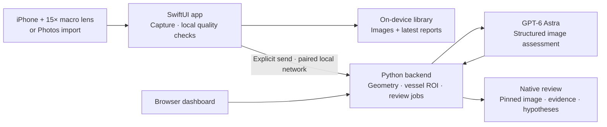

# OptoLab

### Turn iPhone macro images into eye-image assessments you can inspect and question.

OptoLab combines an **iPhone 15 Pro, a 15× macro attachment, and GPT-6 Astra** to make a complete capture-to-analysis demo: photograph an eye, inspect candidate anatomical overlays, and get an image-specific report with observations, provisional interpretations, alternative explanations, and ways to check them.

The goal is convenient, repeatable anterior-eye imaging with transparent analysis. The working prototype connects a native SwiftUI app to a Python backend; images and reports can be reopened from an on-device library.

## See the demo

1. **Capture or import.** Use the rear wide camera with the macro attachment, or choose an image from Photos.
2. **Inspect.** Save a square camera frame, retake immediately, and optionally mark exposed conjunctiva for vessel analysis.
3. **Send to Astra.** One explicit action runs local measurements and a structured image assessment.
4. **Question the result.** The image stays pinned while the report scrolls. Read the main insight, then expand the evidence, competing explanation, and verification steps.
5. **Reopen later.** The iPhone library keeps saved images and their latest reports. Completed backend reviews are cached so recovery does not require another model call.

**Demo tip:** use manual capture for the presentation. Automatic capture has local focus/exposure/stability gates, but its reliability with handheld 15× macro imaging is still being improved.

## What makes it interesting

- **Claims you can test.** Reports locate visible features and explain what supports an interpretation, what is missing, and what could contradict it.
- **Image analysis plus model reasoning.** Python computes experimental pupil/iris candidates and vessel coverage in a selected region. Astra interprets the image; it does not fill missing measurements with invented values.
- **A compact native experience.** Manual/Auto controls, top-level Retake, Photos import, segmentation overlays, and a dismissible review modal with a pinned image.
- **A local image library.** SwiftData/SQLite stores images and reports on the iPhone; previously saved results reopen offline.
- **Deliberate API spending.** Camera guidance runs locally. Sending is explicit, completed reviews are cached, and phone polling does not resubmit paid model requests.
- **One shared backend.** Native iPhone and browser clients use the same Python measurement and review pipeline. The OpenAI key stays on the Mac.

## What Astra returns

Each detailed review includes a concise **main insight** and up to five claims:

| Field | What it answers |
| --- | --- |
| Claim and location | What is visible, and where in the image? |
| Source frames | Which supplied images support it? |
| Visual confidence | How clearly is the feature visible? |
| Provisional interpretation | What might explain the finding? |
| Alternative | What other explanation fits, including anatomy or acquisition artifacts? |
| Evidence and verification | What supports it, what is missing, and how could we check it? |

The report also assesses all six [research targets](specs/details.json): scleral color, conjunctival vascularity, inner-eyelid color, pupil/iris ratio, pupil light response, and peripheral corneal appearance. Each target can be observed, ungradable, or not captured. These are assessment categories—not six validated diagnostic tests.

## Architecture



**Deployment today:** the app runs on the iPhone; analysis requires the Mac backend and internet access for Astra. USB supports development installation and pairing transfer. The app's analysis requests use the network. This is not a standalone cloud deployment or on-device Astra inference.

## Run it

### 1. Start the Mac backend

Requires Python 3.11+.

```sh
python3 -m venv vision/.venv
vision/.venv/bin/pip install -e 'vision[astra,live]'
```

Create a `.env` file in the repository root:

```dotenv
oai_api_key=your_openai_api_key
```

`OPENAI_API_KEY` is also supported. The configured account must have access to `gpt-6-astra`.

Start the phone-facing server using your Mac's local hostname:

```sh
vision/.venv/bin/eye-live --port 8766 \
  --lan-url "http://$(scutil --get LocalHostName).local:8766" \
  --output vision/runs/mobile
```

Keep both devices on the same reachable local network. The development server uses authenticated local HTTP. API keys, pairing files, captures, and generated reports are Git-ignored.

### 2. Install the iPhone app

Open [ios/backup/eye-backup.xcodeproj](ios/backup/eye-backup.xcodeproj) in Xcode. Select the `eye-backup` scheme, choose your signing team and connected iPhone, then Run. The installed app is named **OptoLab**; the project path retains its original development name.

Enable Developer Mode when prompted, and allow Camera and Local Network access. See the [native app guide](ios/backup/readme.md) for installation details.

### 3. Pair and analyze

Privately transfer the contents of `vision/runs/mobile/mobile-pairing.json` into **OptoLab → Settings → Mac connection → Use pairing configuration**. On macOS, copy without printing the token:

```sh
pbcopy < vision/runs/mobile/mobile-pairing.json
```

Tap **Check connection**, capture/import an image, then **Send to Astra**. Pairing must be loaded again after app termination or a backend restart. Older cached reports have a separate **Generate detailed analysis · uses API credits** action.

For a browser-only walkthrough, run `vision/.venv/bin/eye-live --port 8765` and open `http://127.0.0.1:8765` on the Mac. The native app is the primary hackathon demo; see the [browser guide](docs/guides/live-demo.md) for its workflow.

## Built and checked

- Signed build, installation and launch on a physical **iPhone 15 Pro**.
- Phone-to-Mac authenticated connection verified from the native app.
- **43 automated Python tests**, covering request contracts, measurement gates, input validation, review-job deduplication, cached recovery, and evidence references.
- One recent live detailed-review check returned three structured claims in approximately **42 seconds**. This is an observed run, not a latency guarantee or accuracy benchmark.
- Simulator layout checks using real saved responses; native report decoding and local-library persistence checks.

Run the backend tests:

```sh
vision/.venv/bin/python -m unittest discover -s vision/tests -q
```

## Research scope and next steps

OptoLab is an experimental hackathon prototype. Its interpretations are hypotheses, and its segmentation and measurements have not been clinically validated. A “usable” capture is suitable for visual review; it does not establish diagnostic adequacy. The 15× attachment is not a physical or color calibration, and one still cannot measure a timed pupil response.

Next milestones are more reliable burst selection, independently evaluated tissue segmentation, symptom/context input, bounded literature-search tools, and clinician-referenced evaluation. Those capabilities are planned, not represented as already working.

The app stores captures on the iPhone and the backend stores submitted cases on the Mac. **Deletion is not automatic.** Sending a frame to Astra transmits it to OpenAI. See the [image-library guide](docs/guides/image-library.md) and [report design/evaluation notes](docs/development/testable-image-reports.md).

## Explore the project

| Location | Contents |
| --- | --- |
| [ios/backup](ios/backup/readme.md) | Working OptoLab iPhone app |
| [ios/shared](ios/shared/analysis_client.swift) | Shared native API models and transport |
| [vision](vision/readme.md) | Python backend, video preparation, browser demo and tests |
| [specs/details.json](specs/details.json) | Six research targets and measurement requirements |
| [docs/research/literature-review.md](docs/research/literature-review.md) | Literature and presentation references |
| [docs](docs/readme.md) | Setup guides, architecture, evaluation and activity log |

The native visual design incorporates work from the partner OptLab UI/UX prototype. Its original source is preserved under the archive tag `archive/optlab-uiux-2026-09-10`; the integrated application above is the submission path.
